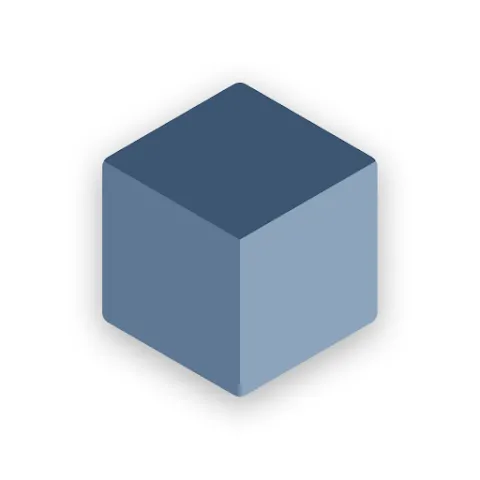
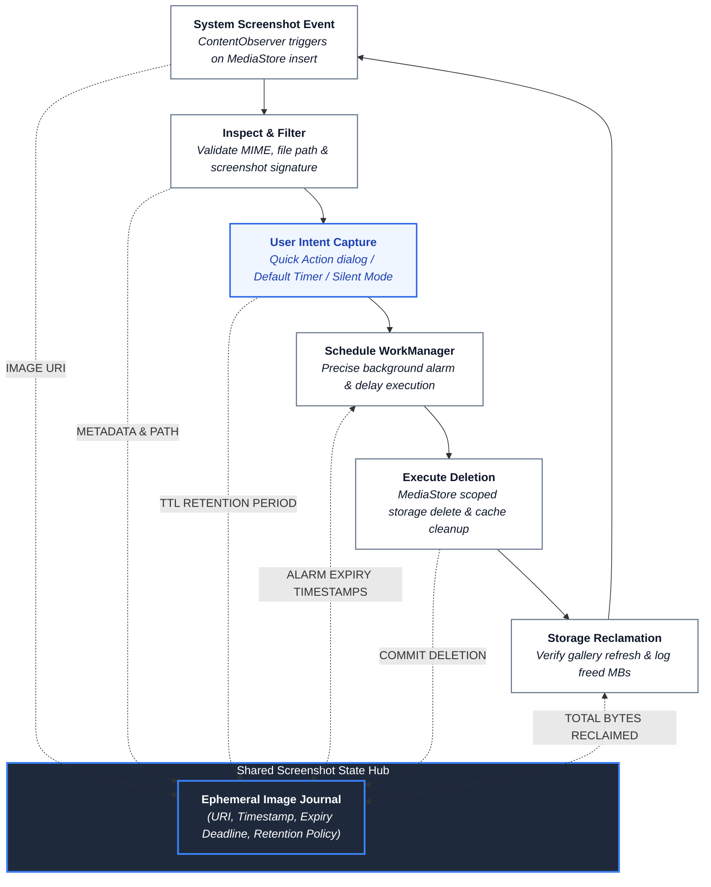

<p align="center">
  
</p>

<h1 align="center">Mark - Auto Screenshot Deleter</h1>

<p align="center">
  <strong>The intelligent screenshot utility for Android — automatically purge ephemeral screenshots, prevent gallery clutter, and reclaim storage with smart auto-delete timers.</strong>
</p>

<p align="center">
  <a href="https://play.google.com/store/apps/details?id=com.markOne.ss_app"></a>
  <a href="LICENSE"></a>
  
  
  
</p>

<p align="center">
  <em>Capture one-time OTPs, delivery addresses, memes, or temporary receipts without letting them pile up and clutter your photo gallery forever.</em>
</p>

---

## 💡 Why Mark?

Most screenshots we take on our smartphones are **disposable**. We capture a transaction confirmation, a tracking code, an address, a quick chat snippet to forward, or a temporary boarding pass. Once viewed or shared, their purpose is finished.

Yet, traditional smartphone operating systems save every single screenshot permanently to your camera roll. Over months, your gallery gets cluttered with thousands of meaningless, forgotten images consuming gigabytes of precious storage space.

> *"Screenshots should be ephemeral by default."*  
> **Mark** silently listens for new screenshot captures and prompts you with a quick action to schedule automatic deletion, or operates in complete stealth mode. When the timer expires, the screenshot is cleaned up automatically.

---

## ⚡ Feature Comparison (Default Gallery vs. Mark Utility)

<table>
  <thead>
    <tr>
      <th width="50%">📱 Stock Android Screenshot Experience</th>
      <th width="50%">⚡ Mark - Auto Screenshot Deleter</th>
    </tr>
  </thead>
  <tbody>
    <tr>
      <td><b>Permanent Storage:</b> Every single temporary screenshot lives in your gallery forever until manually deleted.</td>
      <td><b>Scheduled Auto-Purge:</b> Automatically removes disposable screenshots after 1 min, 5 mins, 1 hour, or 1 day.</td>
    </tr>
    <tr>
      <td><b>Manual Cleanup Burden:</b> You must regularly browse through hundreds of junk images to find real memories.</td>
      <td><b>Zero Maintenance:</b> Set your preferred timer once. Your gallery stays clean without lifting a finger.</td>
    </tr>
    <tr>
      <td><b>Tedious Multi-Step Sharing:</b> Capture $\rightarrow$ Open Gallery $\rightarrow$ Share $\rightarrow$ Delete original manually.</td>
      <td><b>Instant Share & Auto-Delete:</b> Share directly from the prompt; Mark queues the image for immediate deletion afterwards.</td>
    </tr>
    <tr>
      <td><b>Intrusive UI Popups:</b> Screen clutter and full-screen confirmations interrupt your workflow.</td>
      <td><b>Silent Mode & Discreet Prompts:</b> Unobtrusive bottom sheets or completely silent background scheduling.</td>
    </tr>
    <tr>
      <td><b>Accidental Data Loss:</b> Batch cleaning tools risk deleting valuable photos along with junk.</td>
      <td><b>Granular Whitelist / Keep:</b> Easily tap "Keep" on critical captures so they are never touched.</td>
    </tr>
  </tbody>
</table>

---

## 🏗️ System Architecture & Data Flow

Mark functions through a background file observation pipeline, pairing **Android ContentObserver / FileObserver** with the **WorkManager Persistent Scheduler**.

### The Ephemeral Screenshot Loop (Continuous Cleanup Engine)

Inspired by closed-loop state feedback architectures, Mark orchestrates screenshot detection, user intent capture, and scheduled garbage collection around a central **Ephemeral Image Journal**:



---

### Real-Time Screenshot Interception & Processing Pipeline

```mermaid
flowchart LR
    subgraph AndroidOS["Android System Layer"]
        User["User takes screenshot<br/>(Power + Vol Down)"] --> OSStore["MediaStore.Images.Media"]
    end

    subgraph Detection["Mark Background Daemon"]
        OSStore == "ContentObserver onChange()" ==> Watcher["ScreenshotObserver"]
        Watcher --> Debounce["Debounce & Path Validator"]
    end

    subgraph ActionRouting["Decision Engine"]
        Debounce --> ModeCheck{"Execution Mode?"}
        ModeCheck -- "Prompt Mode" --> Toast["Discreet Action Prompt<br/>(Keep / 1m / 5m / Share)"]
        ModeCheck -- "Silent Mode" --> AutoSched["Auto-Schedule Default TTL"]
    end

    subgraph DeletionPipeline["WorkManager Queue"]
        Toast --> Worker["DeleteScreenshotWorker"]
        AutoSched --> Worker
        Worker == "On Expiry" ==> Purge["MediaStore.delete()<br/>Permanent Removal"]
    end

    classDef os fill:#0F172A,stroke:#64748B,stroke-width:1.5px,color:#F8FAFC;
    classDef detect fill:#1E293B,stroke:#3B82F6,stroke-width:1.5px,color:#F8FAFC;
    classDef routing fill:#0F172A,stroke:#10B981,stroke-width:2px,color:#E2E8F0;
    classDef del fill:#1E1E2E,stroke:#EF4444,stroke-width:1.5px,color:#CDD6F4;

    class User,OSStore os;
    class Watcher,Debounce detect;
    class ModeCheck,Toast,AutoSched routing;
    class Worker,Purge del;
```



---

## 🎯 Core Capabilities & Feature Breakdown

<table>
<tr>
  <td width="33%" align="center">
    <h3>⏱️ Flexible Auto-Delete Timers</h3>
    <sub>Choose custom lifespans: 1 minute, 5 minutes, 15 minutes, 1 hour, or 24 hours. The image is wiped when time runs out.</sub>
  </td>
  <td width="33%" align="center">
    <h3>🤫 Silent Background Mode</h3>
    <sub>Prefer no interruptions? Enable Silent Mode to automatically queue every new screenshot without showing popups.</sub>
  </td>
  <td width="33%" align="center">
    <h3>📤 Share & Auto-Clean</h3>
    <sub>Send a screenshot via WhatsApp, Telegram, or Email directly from Mark's prompt; Mark deletes the local file right after.</sub>
  </td>
</tr>
<tr>
  <td width="33%" align="center">
    <h3>🛡️ One-Tap "Keep" Whitelisting</h3>
    <sub>Took a screenshot of an important flight ticket or tax invoice? Tap "Keep" to prevent automatic deletion permanently.</sub>
  </td>
  <td width="33%" align="center">
    <h3>🔒 100% Offline & Private</h3>
    <sub>Zero network calls, no internet permissions required, and no telemetry. All operations execute strictly on your device.</sub>
  </td>
  <td width="33%" align="center">
    <h3>🔋 Ultra Battery Friendly</h3>
    <sub>Uses Android's event-driven ContentObserver and modern WorkManager API. Zero background battery drain or idle polling.</sub>
  </td>
</tr>
</table>

---

## 🔍 Detailed Component Breakdown

### 1. `ScreenshotObserver` (MediaStore Listener)
- Registers a targeted `ContentObserver` on `MediaStore.Images.Media.EXTERNAL_CONTENT_URI`.
- Uses regex pattern matching (`Screenshots/` directory and `Screenshot_` filename prefixes) to distinguish screenshots from normal camera photos or downloaded pictures.
- Incorporates a debounce buffer to prevent duplicate triggers from Android OS thumbnail generation.

### 2. `DeleteScreenshotWorker` (WorkManager Queue)
- Enqueues reliable background tasks that survive device reboots, app kills, and Doze mode.
- Uses Android's Scoped Storage APIs to permanently delete designated URIs without requiring legacy root or all-files access permissions.

### 3. Quick Action Overlay & Notification Tray
- Non-blocking floating action pill or system notification action with simple triggers:
  - **[Keep]**: Cancels deletion and archives the image safely.
  - **[Delete Now]**: Immediate file wipe.
  - **[Share & Delete]**: Opens Android share sheet and triggers post-share disposal.

---

## 📁 Repository Structure

```text
Mark_Auto_Screenshot_deleter/
├── app/                         <-- Buildable Android Application Module (Gradle, Kotlin)
│   ├── src/main/
│   │   ├── AndroidManifest.xml   <-- Application Manifest & Service declarations
│   │   ├── java/com/markOne/ss_app/
│   │   │   ├── service/          <-- ScreenshotObserver & ContentObserver Daemon
│   │   │   ├── worker/           <-- WorkManager scheduled DeleteScreenshotWorker
│   │   │   ├── receiver/         <-- BootReceiver & NotificationActionReceiver
│   │   │   ├── ui/               <-- SettingsActivity, Onboarding & QuickDialog
│   │   │   └── util/             <-- MediaStoreHelper, StorageManager & Preferences
│   │   ├── res/                  <-- Layout XMLs, drawables, strings, color themes
│   │   └── assets/               <-- Assets and bundled models
│   ├── build.gradle.kts          <-- App dependencies & SDK compile targets
│   └── proguard-rules.pro        <-- Optimization & R8 keep rules
│
├── evidence-archives/           <-- Full Decompilation & Recovery ZIP Archives
│   ├── recovered-smali.zip      <-- Full apktool smali bytecode (12,002 files)
│   ├── recovered-jadx.zip       <-- Full JADX decompiled sources (11,582 .java)
│   ├── recovered-dex.zip        <-- Original classes.dex
│   ├── recovered-native.zip     <-- arm64-v8a native libraries
│   ├── recovered-assets.zip     <-- Extracted assets
│   ├── recovered-resources.zip  <-- Decoded resources and layouts
│   └── original-xapk-splits.zip <-- Split parts of original XAPK
│
├── assets/                      <-- High-Resolution App Icons & Branding Assets
│   ├── app_icon.png             <-- Official Mark App Icon (PNG)
│   ├── logo.png                 <-- High-resolution branding logo
│   └── app_icon.webp            <-- Original WebP icon asset
│
├── documentation/               <-- Technical Architecture, Values & Evidence Scans
├── Others_REPORT.md             <-- Comprehensive recovery and status report
├── Others_COMPONENTS.md         <-- Reconstructed application components
├── Extra_COMPONENTS.md          <-- Additional module breakdowns
└── README.md                    <-- Comprehensive Project & Application Guide
```

---

## 🛠️ Technical Specifications

| Property | Details |
| :--- | :--- |
| **Application ID** | `com.markOne.ss_app` |
| **Version** | v7.1 (Version Code: `59`) |
| **Minimum SDK** | Android 8.0 (API Level 26 - Oreo) |
| **Target SDK** | Android 14+ (API Level 34 / 35, Compile SDK 36) |
| **Language & Architecture** | Kotlin, MVVM, Android Jetpack |
| **Background Scheduling** | AndroidX WorkManager (`androidx.work:work-runtime-ktx`) |
| **File Observation** | `android.database.ContentObserver` on MediaStore |
| **Storage Compliance** | Scoped Storage API (`MediaStore.createDeleteRequest`) |
| **Network Footprint** | **0 KB** (Completely offline, no internet permission) |

---

## 🎨 Asset Resources

This repository includes official high-resolution branding assets located in [`assets/`](assets/):
- 📦 **Mark Official App Icon (PNG)**: [`assets/app_icon.png`](assets/app_icon.png)
- 🖼️ **High-Res Logo (PNG)**: [`assets/logo.png`](assets/logo.png)
- 🌐 **WebP Original Asset**: [`assets/app_icon.webp`](assets/app_icon.webp)

---

## 🚀 Building & Running the Project

1. Install **Android SDK 36** + **JDK 17**.
2. Open the project in **Android Studio** (Koala / Ladybug or newer recommended).
3. Restore `app/google-services.json` from your Firebase console if using analytics/push services.
4. Allow Gradle to sync dependencies (Gradle 8.13, AGP 8.7.3, Kotlin 2.0.21).
5. Run on a physical Android device or emulator running API 26+.
6. Grant storage/media permissions when prompted and take a screenshot to test the auto-delete workflow!

---

## 📄 License

Distributed under the [MIT License](LICENSE). Copyright &copy; 2026 [Arafath Rahman](https://github.com/smartworldarafath).
